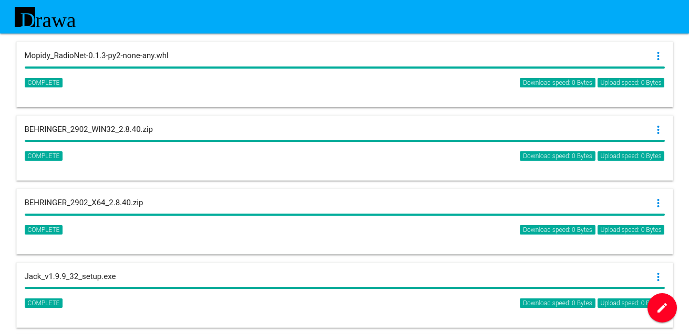

# Drawa

Drawa is a Download Manager & a GUI for aria2 with built-in Chomikuj.pl support. It's written in Python 3.6 and can be extended by plugins.


# Installing

Clone this repo and run:

> python setup.py install

Or install by pip:

> pip install drawa

# Configuring

Drawa is searching for configuration file: _~/.config/drawa/drawa.conf_

Location may be also provided by _--config_ argument, like:

> drawa --config /etc/drawa/drawa.conf

Default configuration is always loaded, but it's overwritten by provided one.

```ini
# default.conf
[drawa]
username=
password=
hostname=0.0.0.0
port=5001

[chomikbox]
enabled=False
username=
password=

[aria2]
hostname=localhost
port=6800
secret=secret_token
config=$HOME/.aria2/aria2.conf # or e.g., /etc/drawa/aria2.conf
```

# Configuring Aria2

Because Drawa uses Aria2, it must by configured properly. Create configuration file in location provided in Drawa configuration.
Do not forget to change download directory.

Example aria2.conf

```
# $HOME/.aria2/aria2.conf
continue
daemon=true
dir=/home/drawa/Downloads
file-allocation=falloc
log-level=warn
max-connection-per-server=4
max-concurrent-downloads=3
max-overall-download-limit=0
min-split-size=5M
enable-http-pipelining=true
```

# Starting Drawa

If Drawa is configured you can run _drawa_ command and go to: http://localhost:5001

# Running as daemon

Drawa can also start as daemon. Package provides _systemd_ script for Drawa.

1. Edit Aria2 configuration file in _/etc/drawa/aria2.conf_
2. Edit Drawa configuration file in _/etc/drawa/drawa.conf_
4. Create directory for download and grant access for user _drawa_

If you want to start service:
> systemctl start drawa

If you want to check for errors:
> systemctl start drawa


